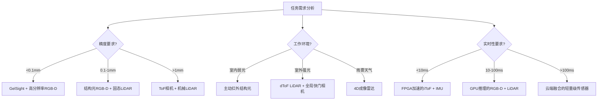

---
title: "具身智能的多模态感知系统：从传感器硬件到环境理解的完整技术栈解析"
date: "2024-12-19"
author: "AI技术专家"
categories: ["AI", "深度学习", "具身智能", "机器人感知"]
tags: ["多模态融合", "RGB-D", "LiDAR", "触觉感知", "PointNet++", "Transformer", "传感器融合", "SLAM"]
description: "深入解析具身智能多模态感知系统的完整技术栈，从RGB-D相机、激光雷达到触觉传感器的工作原理，到早期/晚期融合策略与Transformer跨模态对齐机制，结合PointNet++点云处理和卡尔曼滤波等关键技术，探讨工业自动化与自动驾驶中的实战应用，为机器人环境理解提供系统性技术指南。"
---

## 开篇引入：为什么机器人需要"五感俱全"？

想象一下，你闭着眼睛试图在陌生房间里泡一杯咖啡。即便听觉和触觉再敏锐，这个过程也充满挑战——你可能会撞到家具、找不到咖啡罐、甚至无法判断杯子是否已倒满。这正是早期机器人面临的困境：**单一模态感知难以支撑复杂环境交互**。

在工业质检场景中，仅依赖视觉的机器人可能无法检测产品表面的微小划痕；在服务机器人导航时，纯激光雷达方案难以识别玻璃幕墙；而在精密装配任务中，缺乏触觉反馈的机械臂极易损坏脆弱零件。这些现实挑战催生了一个共识：**具身智能必须像人类一样，通过视觉、深度、触觉等多模态信息的协同，构建对物理世界的完整理解**。

本文将带你深入机器人感知栈的核心，从**RGB-D相机**的微米级深度感知，到**GelSight触觉传感器**的力分布成像；从**PointNet++**的点云几何解析，到**Transformer跨模态对齐**的注意力机制，最终构建起从传感器原始数据到环境语义理解的完整技术闭环。

---

## 技术背景：从单一传感器到多模态协同的演进之路

### 机器人感知的三次范式转移

机器人感知技术经历了三个关键阶段：

**第一阶段（2000-2010）：单一传感器主导时代**
- **激光雷达（LiDAR）** 垄断导航定位，通过**飞行时间（ToF）**原理生成稀疏点云
- 单色相机提供二维语义，但缺乏空间几何信息
- 核心局限：环境理解维度单一，难以处理动态障碍和透明物体

**第二阶段（2010-2018）：多传感器简单叠加**
- **RGB-D相机**（如Kinect）普及，同步输出彩色图像与深度图
- **惯性测量单元（IMU）** 与摄像头进行松耦合融合
- 典型应用：**SLAM**技术中激光雷达与视觉里程计的简单互补

> **核心洞察**：此阶段的"多模态"本质是数据层面的拼接，而非语义层面的融合。各传感器独立处理后再做决策级加权，信息损失严重。

**第三阶段（2018至今）：深度学习驱动的深度融合**
- **早期融合（Early Fusion）**：在特征提取前融合原始数据
- **晚期融合（Late Fusion）**：在决策层融合各模态预测结果
- **Transformer架构**实现真正的跨模态注意力对齐
- **PointNet++**等网络原生处理点云拓扑结构

### 具身智能对感知系统的新要求

与传统机器人不同，**具身智能（Embodied AI）** 强调智能体与物理环境的深度交互，这要求感知系统具备：

1. **实时性**：端到端延迟需低于100ms以支持闭环控制
2. **鲁棒性**：在光照变化、传感器噪声、遮挡等条件下保持稳定
3. **细粒度**：不仅识别"是什么"，更要理解"怎么样"（如物体材质、抓取可行性）
4. **可学习性**：感知模型需与策略网络联合优化，形成感知-动作闭环

---

## 核心原理：多模态感知的技术基石

### 深度感知的三重奏：RGB-D相机技术解构

现代RGB-D相机主要采用三种深度获取技术，其原理差异直接影响机器人感知质量：

#### 1. **结构光（Structured Light）**：编码空间的几何解码器
以**PrimeSense**（Kinect V1核心技术）为例，通过投射近红外伪随机散斑图案，利用三角测量原理计算深度。其**基线（Baseline）**设计是关键——15cm左右的投射-接收距离可平衡精度与体积。

**工作流程**：
```
投射器 → 编码图案 → 物体表面形变 → 红外相机捕获 → 与参考图案匹配 → 视差计算 → 深度图生成
```

**数学本质**：深度值 \(d\) 与视差 \(\Delta x\) 满足：
$$ d = \frac{f \cdot B}{\Delta x} $$
其中 \(f\) 为焦距，\(B\) 为基线长度。精度随距离平方衰减（\(\sigma_d \propto d^2\)），在1m距离可达±3mm，3m时恶化至±5cm。

#### 2. **飞行时间（ToF）**：光速尺测量空间
**dToF（直接飞行时间）** 通过SPAD（单光子雪崩二极管）直接测量光子往返时间，精度达毫米级但成本高昂。**iToF（间接飞行时间）** 则采用连续波调制，测量相位差：

$$ d = \frac{c \cdot \Delta\phi}{4\pi f_{mod}} $$

其中 \(c\) 为光速，\(\Delta\phi\) 为发射与接收信号的相位差，\(f_{mod}\) 为调制频率。iToF在0.5-5m范围内保持±1cm精度，且抗环境光干扰能力强。

#### 3. **主动立体视觉（Active Stereo）**：左右眼+结构光增强
**Intel RealSense D435**采用双红外相机+纹理投射器，在弱纹理表面主动投射随机点云辅助匹配。其优势在于：
- 兼具立体视觉的高分辨率和结构光的鲁棒性
- 支持户外强光环境（通过红外滤光片）
- 深度与RGB像素天然对齐，无需额外配准

**技术对比表**：

| 技术路线 | 精度（1m处） | 有效范围 | 功耗 | 成本 | 适用场景 |
|---------|-------------|---------|------|------|---------|
| 结构光 | ±3mm | 0.3-3m | 中 | 低 | 室内交互、人脸扫描 |
| iToF | ±10mm | 0.5-5m | 低 | 中 | 导航避障、动态跟踪 |
| dToF | ±3mm | 0.1-10m | 高 | 高 | 工业测量、自动驾驶 |
| 主动立体 | ±5mm | 0.2-10m | 中 | 中 | 通用机器人感知 |

### 触觉感知：GelSight与OptoForce的力觉成像革命

视觉提供"看什么"，而**触觉传感器（Tactile Sensor）** 解答"怎么摸"。**GelSight**技术通过软质凝胶接触面记录微观形变：

**工作原理**：
1. **接触层**：透明硅胶垫（硬度30A Shore）包裹待测物体
2. **照明系统**：三色LED以特定角度照射凝胶表面
3. **成像单元**：高分辨率相机（>1MP）捕获光线在形变表面的反射模式
4. **重建算法**：光度立体法（Photometric Stereo）将2D图像转换为3D力分布图

> **核心洞察**：GelSight将力信号转换为视觉信号处理，巧妙复用成熟计算机视觉算法，实现<5μm的力定位精度和<0.05N的力分辨率。

**OptoForce**则采用**光学力传感（Optical Force Sensing）** ，在弹性体内嵌入标记点阵，通过跟踪标记点位移计算六维力/力矩：

$$ \mathbf{F} = \mathbf{K} \cdot \Delta\mathbf{x} $$

其中 \(\mathbf{K}\) 为刚度矩阵，通过出厂标定获得。其优势在于：
- **高动态范围**：可检测0.1N-100N的力
- **低漂移**：光学测量不受温度影响，年漂移<1%
- **快速响应**：带宽达1kHz，支持滑动检测（Slip Detection）

滑动检测通过监测接触面切向力的快速变化实现，当检测到滑动时，法向力需增加约20-30%以维持稳定抓取。

### 激光雷达：从稀疏点云到密集语义

**LiDAR**作为机器人感知的"老兵"，在固态化、芯片化浪潮中焕发新生。**MEMS振镜**和**OPA（光学相控阵）**技术将机械旋转部件转为固态扫描，使成本下降90%至百元级。

**ToF-LiDAR的物理极限**：
- **角分辨率**：受限于光束发散角，典型值0.1°-0.5°
- **距离分辨率**：\(\Delta R = \frac{c}{2B}\)，其中 \(B\) 为激光带宽，1550nm波段可达1cm
- **多回波检测**：穿透树叶、雨雾等半透明介质，提取最近/最远/最强回波

**点云生成流程**：
```
激光发射 → 飞行时间测量 → 水平/垂直角度编码 → 球坐标转换 → 笛卡尔坐标点云
```

对于360°旋转LiDAR，点云坐标计算为：
$$ (x, y, z) = (r \cos\theta \sin\phi, r \sin\theta \sin\phi, r \cos\phi) $$
其中 \(r\) 为测距值，\(\theta\) 为水平角，\(\phi\) 为垂直角。

---

## 实现细节：从数据流到智能决策

### 多模态融合架构设计

#### 方案A：早期融合（Pixel-Aligned Fusion）

早期融合在**数据层**或**特征层**进行对齐，最大化信息互补性：

**实现流程**：
1. **时空同步**：通过**硬件触发（Hardware Trigger）** 实现微秒级同步，或使用**时间戳插值（Timestamp Interpolation）** 对齐异频传感器
2. **数据对齐**：将LiDAR点云投影到相机坐标系，利用**外参矩阵（Extrinsic Matrix）** 转换：
   $$ \mathbf{p}_{cam} = \mathbf{R}_{ext} \cdot \mathbf{p}_{lidar} + \mathbf{t}_{ext} $$
3. **特征拼接**：在像素级拼接RGB值、深度值、表面法向量，形成5-8通道张量
4. **联合编码**：使用**卷积神经网络（CNN）** 提取多模态融合特征

**代码示例：点云到图像的投影融合**
```python
import numpy as np
import open3d as o3d

def fuse_lidar_to_image(point_cloud, image, extrinsics, intrinsics):
    """
    将LiDAR点云投影到图像平面实现早期融合
    
    参数:
        point_cloud: (N, 4) 点云数组 (x, y, z, intensity)
        image: (H, W, 3) RGB图像
        extrinsics: (4, 4) LiDAR到相机的外参矩阵
        intrinsics: (3, 3) 相机内参矩阵
    """
    # 1. 转换到相机坐标系
    points_homo = np.hstack([point_cloud[:, :3], np.ones((len(point_cloud), 1))])
    points_cam = (extrinsics @ points_homo.T).T[:, :3]  # (N, 3)
    
    # 2. 投影到图像平面
    points_proj = (intrinsics @ points_cam.T).T  # (N, 3)
    u = (points_proj[:, 0] / points_proj[:, 2]).astype(int)
    v = (points_proj[:, 1] / points_proj[:, 2]).astype(int)
    
    # 3. 过滤视场外点
    valid_mask = (u >= 0) & (u < image.shape[1]) & (v >= 0) & (v < image.shape[0]) & (points_cam[:, 2] > 0)
    u_valid, v_valid = u[valid_mask], v[valid_mask]
    
    # 4. 创建融合特征图 (H, W, 4: RGB-D)
    fused_map = np.zeros((image.shape[0], image.shape[1], 4), dtype=np.float32)
    fused_map[v_valid, u_valid, :3] = image[v_valid, u_valid] / 255.0  # 归一化RGB
    fused_map[v_valid, u_valid, 3] = points_cam[valid_mask, 2]  # 深度值
    
    return fused_map

# 使用示例
# 假设已有外参（通过手眼标定获得）和内参（相机出厂参数）
extrinsics = np.load('lidar_to_cam_extrinsics.npy')  # (4, 4)
intrinsics = np.array([[fx, 0, cx], [0, fy, cy], [0, 0, 1]])
fused_map = fuse_lidar_to_image(point_cloud, rgb_image, extrinsics, intrinsics)
```

**优势**：信息损失最小，可学习跨模态底层关联
**劣势**：对传感器标定误差敏感，计算量大

#### 方案B：晚期融合（Decision-Level Fusion）

晚期融合在各模态独立推理后合并结果，架构灵活：

**实现流程**：
1. **独立编码**：RGB图像送**CNN**检测物体类别，点云送**PointNet++**提取几何特征，触觉数据送**MLP**判断抓取稳定性
2. **置信度加权**：各模态输出概率分布，根据**传感器可信度（Sensor Confidence）** 动态加权：
   $$ P_{final} = \sum_{i=1}^{N} w_i \cdot P_i, \quad w_i = \frac{e^{c_i}}{\sum_{j} e^{c_j}} $$
   其中 \(c_i\) 为第i个模态的置信度分数
3. **冲突消解**：当视觉识别为"杯子"而触觉感知为"软质"时，触发**矛盾检测（Conflict Detection）** 机制，降级视觉权重

**优势**：模块化强，易于扩展新传感器；对单个传感器故障鲁棒
**劣势**：高层信息融合，丢失底层互补性

### PointNet++：点云几何理解的利器

**PointNet++**通过**层次化特征学习（Hierarchical Feature Learning）** 解决点云无序性和非结构化问题：

**核心创新**：
- **集合抽象层（Set Abstraction）**：使用**最远点采样（FPS）** 选取中心点，通过**球查询（Ball Query）** 构建局部邻域
- **MSG/MRG多尺度分组**：Multi-Scale Grouping捕获不同尺度几何结构
- **特征传播层（Feature Propagation）**：上采样时通过**插值**恢复点级特征

**网络结构描述**：
```
输入点云 (N, 3) → SA层1: FPS采样 → 局部特征提取 → 下采样 (N/4, 128维)
                ↓
            SA层2: 更稀疏采样 → 上下文聚合 → (N/16, 256维)
                ↓
            SA层3: 全局特征 → (1, 1024维)
                ↓
            FP层: 插值上采样 → 逐点语义分割 (N, 13类)
```

**代码示例：PointNet++语义分割核心模块**
```python
import torch
import torch.nn as nn
from pointnet2_ops import pointnet2_utils

class PointNetPlusPlus(nn.Module):
    def __init__(self, num_classes=13):
        super().__init__()
        # 三层集合抽象，逐步降低采样率
        self.sa1 = SetAbstraction(npoint=1024, radius=0.1, nsample=32, in_channel=3, mlp=[32, 32, 64])
        self.sa2 = SetAbstraction(npoint=256, radius=0.2, nsample=64, in_channel=64, mlp=[64, 64, 128])
        self.sa3 = SetAbstraction(npoint=64, radius=0.4, nsample=128, in_channel=128, mlp=[128, 128, 256])
        
        # 特征传播层，逐步上采样
        self.fp3 = FeaturePropagation(in_channel=256+128, mlp=[256, 256])
        self.fp2 = FeaturePropagation(in_channel=256+64, mlp=[256, 128])
        self.fp1 = FeaturePropagation(in_channel=128+3, mlp=[128, 128, 128])
        
        self.classifier = nn.Linear(128, num_classes)
        
    def forward(self, xyz):
        """
        前向传播
        参数:
            xyz: (B, N, 3) 批量点云坐标
        """
        B, N, _ = xyz.shape
        
        # 下采样路径：提取多尺度特征
        l1_xyz, l1_points = self.sa1(xyz, None)  # 1024个点，64维特征
        l2_xyz, l2_points = self.sa2(l1_xyz, l1_points)  # 256个点，128维特征
        l3_xyz, l3_points = self.sa3(l2_xyz, l2_points)  # 64个点，256维特征
        
        # 上采样路径：插值恢复逐点特征
        l2_points = self.fp3(l2_xyz, l3_xyz, l2_points, l3_points)  # 插值到256点
        l1_points = self.fp2(l1_xyz, l2_xyz, l1_points, l2_points)  # 插值到1024点
        l0_points = self.fp1(xyz, l1_xyz, None, l1_points)  # 插值到原始分辨率
        
        # 逐点分类
        seg_pred = self.classifier(l0_points)  # (B, N, num_classes)
        return seg_pred

class SetAbstraction(nn.Module):
    """集合抽象层：采样+分组+特征提取"""
    def __init__(self, npoint, radius, nsample, in_channel, mlp):
        super().__init__()
        self.npoint = npoint
        self.radius = radius
        self.nsample = nsample
        self.mlp_convs = nn.ModuleList()
        
        # 多层感知机提取局部特征
        last_channel = in_channel + 3  # +3 for xyz坐标
        for out_channel in mlp:
            self.mlp_convs.append(nn.Conv2d(last_channel, out_channel, 1))
            last_channel = out_channel
            
    def forward(self, xyz, points):
        # 1. FPS采样中心点
        idx = pointnet2_utils.furthest_point_sample(xyz, self.npoint)  # (B, npoint)
        new_xyz = pointnet2_utils.gather_operation(xyz.transpose(1,2).contiguous(), idx).transpose(1,2)
        
        # 2. 球查询分组
        grouped_idx = pointnet2_utils.ball_query(self.radius, self.nsample, xyz, new_xyz)
        
        # 3. 局部特征提取...
        return new_xyz, grouped_features
```

### 传感器标定：多模态融合的基石

**手眼标定（Hand-Eye Calibration）** 是确定传感器与机器人末端执行器相对位姿的关键。对于眼在手外（Eye-in-Hand）配置，求解**AX=XB方程**：

$$ \mathbf{A}_i \mathbf{X} = \mathbf{X} \mathbf{B}_i $$

其中 \(\mathbf{A}_i\) 为机器人末端位姿变化，\(\mathbf{B}_i\) 为相机观测到的标定板位姿变化，\(\mathbf{X}\) 为待求的外参矩阵。

**实践技巧**：
- 采用**Tsai-Lenz算法**，至少20组不同姿态数据
- 引入**重投影误差（Reprojection Error）** 作为优化目标：
  $$ E = \sum_{i=1}^{N} \| \pi(\mathbf{T}_{ext} \mathbf{p}_i) - \mathbf{u}_i \|^2 $$
- 使用**卡尔曼滤波在线标定**应对温度漂移和机械形变

**时间同步**的三种策略：
1. **硬件同步**：通过GPIO触发，精度<1μs，适合高频IMU与相机
2. **软件时间戳**：利用PTP精确时间协议，精度~100μs，适合异构传感器
3. **后期对齐**：基于运动一致性假设插值，精度~10ms，仅适用于慢速场景

---

## 实战应用：从工厂到家庭的感知落地

### 工业自动化：精密装配的多模态质检

**场景**：汽车发动机缸盖装配，需检测螺栓孔位置度（±0.1mm）、垫片是否存在、拧紧力矩是否达标。

**感知栈配置**：
- **RGB-D相机**：检测孔位几何中心和垫片轮廓
- **LiDAR**：扫描缸盖整体形貌，识别翘曲变形
- **六维力传感器**：监测螺栓拧紧过程的力-位移曲线
- **GelSight**：验证垫片压缩后的接触均匀性

**融合策略**：
1. **早期融合**：RGB-D与LiDAR点云配准，构建缸盖数字孪生
2. **中期融合**：力传感器数据与视觉检测的螺栓位置关联，识别螺纹错位
3. **晚期融合**：综合判断"合格/返工/报废"决策

**效果**：漏检率从单模态的3.2%降至0.15%，过杀率从8%降至1.2%。

### 服务机器人：家庭环境中的语义导航

**挑战**：玻璃门、镜面墙、低矮障碍等传统LiDAR的盲区。

**解决方案**：
- **RGB-D相机**（上视+下视）：上视识别玻璃（深度突变），下视检测地面障碍
- **固态LiDAR**（水平扫描）：构建2D占据栅格地图
- **IMU+轮速计**：提供高频位姿估计

**关键技术**：
- **玻璃检测**：利用RGB-D的深度不连续性和镜面反射特性，训练**二分类器**区分真实障碍与玻璃
- **多楼层语义地图**：PointNet++分割点云的"地面"、"墙面"、"家具"，构建**分层拓扑地图**

### 自动驾驶：车路协同的超视距感知

**车端感知**：
- **长距LiDAR**（300m）：高速场景前车检测
- **环视RGB-D**（8个摄像头）：360°近场语义
- **4D成像雷达**：雨雾天气的鲁棒检测

**路侧感知**：
- **高线数LiDAR**（128线）：路口全息感知
- **鱼眼相机**：大范围车辆轨迹跟踪

**融合创新**：通过**Transformer**实现车-路特征对齐，解决遮挡问题。路侧LiDAR检测到被遮挡的行人后，将**特征向量（Feature Vector）** 通过V2X传输给车辆，车辆将其与自身相机特征在BEV（鸟瞰图）空间融合，实现**超视距感知**。

---

## 深度对比：融合策略与传感器选型

### 早期融合 vs 晚期融合：没有银弹

| 维度 | 早期融合 | 晚期融合 |
|------|---------|---------|
| **信息损失** | 低（保留原始数据关联） | 高（丢失底层细节） |
| **计算效率** | 低（需处理高维数据） | 高（各模态并行处理） |
| **标定依赖** | 高（像素级对齐要求严格） | 低（仅需粗略同步） |
| **扩展性** | 差（新增传感器需重训练） | 优（即插即用） |
| **鲁棒性** | 差（单传感器故障影响全局） | 优（可动态降级） |
| **适用场景** | 精密操作（抓取、装配） | 开放环境（导航、监控） |

**混合融合（Hybrid Fusion）** 是当前最佳实践：
- **前端早期融合**：RGB-D相机内部已实现像素对齐，直接输出融合特征
- **后端晚期融合**：不同物理原理的传感器（如视觉与LiDAR）在决策层融合

### 传感器选型决策树



---

## 未来展望：从感知到认知的跨越

### 当前挑战

1. **传感器异构性**：RGB-D的稠密像素与LiDAR的稀疏点云在**数据密度**上相差千倍，统一表征困难
2. **动态环境适应**：光照突变（从室内到室外）、表面反射率变化导致传感器特性漂移
3. **计算资源约束**：边缘端算力有限，需在**精度**与**延迟**间权衡
4. **数据标注成本**：多模态联合标注（像素级分割+点云语义+力觉标签）成本极高

### 前沿研究方向

**1. 神经传感器（Neural Sensor）**
将传感器物理模型嵌入神经网络，实现**端到端联合优化**。例如，将ToF的相位测量方程作为可微层，让网络自动学习补偿多径干扰。

**2. 主动感知（Active Perception）**
机器人主动调整视角、光照或接触力以最大化信息增益。通过**强化学习**训练策略网络，在识别不确定区域时自动靠近观察或触摸验证。

**3. 多模态预训练模型**
借鉴**CLIP**的思想，构建视觉-深度-触觉的对比学习框架。机器人通过**自监督学习**在海量无标签多模态数据上预训练，下游任务仅需少量标注即可微调。

**4. 事件驱动感知**
**事件相机（Event Camera）** 与脉冲LiDAR结合，仅在场景变化时触发数据流，将功耗和延迟降低一个数量级，适合电池供电的移动机器人。

### 产业影响预测

- **2025**：多模态融合成为机器人标配，单模态方案退出高端市场
- **2026**：基于Transformer的跨模态大模型在工业质检领域商业化
- **2027**：触觉传感器成本降至百元级，进入消费级机器人
- **2028**：神经传感器架构成熟，感知-控制端到端训练成为主流

> **终极愿景**：未来的具身智能体将不再区分"模态"，而是像人类大脑一样，将光子的能量、光子的飞行时间、表面的反作用力统一编码为对物理世界的连贯认知。传感器只是信息的不同通道，真正的智能在于**跨通道的注意力与推理**。

---

## 总结：构建你的多模态感知系统

1. **从任务出发**：精密操作选早期融合，开放导航选晚期融合
2. **重视标定**：投入20%项目时间在手眼标定与时间同步
3. **分层处理**：用PointNet++理解几何，用Transformer对齐语义
4. **鲁棒优先**：设计传感器故障时的降级策略
5. **数据驱动**：建立多模态数据集，持续迭代融合模型

多模态感知不是简单的传感器堆砌，而是一门在**物理原理**、**数学建模**与**计算智能**间寻求平衡的艺术。当机器人能同时"看清"玻璃的存在、"摸出"材质的柔软、"听出"机构的异响时，具身智能才真正从实验室走向千家万户。